<div align="center">

# 🐾 WildGuard — Wildlife Detection & Visual Reasoning API

<hr>

### A wildlife monitoring system that detects, reasons, and knows when the evidence is insufficient

<p>
  
  
  
  
  
  
</p>

**Fine-Tuned Real-Time Detection Transformer + Framework-Free Visual Reasoning Engine**

WildGuard detects wildlife in challenging camera-trap imagery, identifies human presence,
and converts structured detections into confidence-aware natural-language answers.

</div>

> 🐾 **Detection:** RT-DETR fine-tuned for wildlife monitoring across 12 classes  
> 🧠 **Reasoning:** Hand-written intent routing + structured scene reasoning  
> 🛡️ **Guardrail:** Explicitly refuses unsupported or insufficiently evidenced answers  
> 🐳 **Deployment:** GPU-enabled FastAPI service packaged with Docker

## Overview

WildGuard is an end-to-end computer vision system designed for wildlife monitoring using camera-trap imagery. The system combines a fine-tuned RT-DETR object detector with an auxiliary human detector and a lightweight, framework-free reasoning layer.

The detection pipeline identifies wildlife and returns structured information including object classes, confidence scores, and bounding boxes. Human detections are incorporated into the same scene representation to support basic human–wildlife interaction analysis.

Beyond object detection, WildGuard accepts natural-language questions about an image. A hand-written intent router determines whether visual evidence is required, the relevant detection models are invoked when necessary, and the reasoning layer operates over the resulting structured detections.

The system is designed to be evidence-aware: when the available detections do not provide sufficient information to support a reliable answer, WildGuard explicitly returns an **insufficient-information** response instead of producing an unsupported conclusion.

The complete application is exposed through FastAPI and can be deployed as a GPU-enabled Docker container.

## RT-DETR Model Architecture

WildGuard uses **RT-DETR (Real-Time DEtection TRansformer)** as its primary object detector. The architecture consists of a backbone, an Efficient Hybrid Encoder, IoU-aware Query Selection, and a Transformer Decoder & Head, providing an end-to-end detection pipeline.

The backbone extracts multi-scale features from the input image, while the hybrid encoder processes these features through AIFI and CCFM before passing selected high-quality features to the decoder.

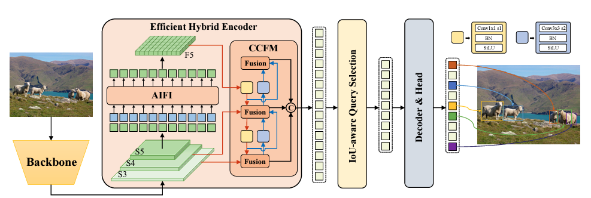

> **Reference:** [RT-DETR — DebuggerCafe](https://debuggercafe.com/rt-detr/)

The **Backbone** extracts feature maps from three stages, **S3, S4, and S5**, which provide information at different scales. The **AIFI (Attention-based Intra-scale Feature Interaction)** processes the high-level S5 features to capture richer semantic information. The **CCFM (CNN-based Cross-scale Feature-fusion Module)** combines information across feature scales. **IoU-aware Query Selection** selects suitable image features as initial object queries for the Transformer decoder. Finally, the **Decoder & Head** refines these queries and generates the predicted bounding boxes and confidence scores for the detected classes.

## System Architecture

WildGuard is organized as a modular inference pipeline in which the FastAPI application acts as the entry point for both direct detection and natural-language visual reasoning.

For a visual query, the request is routed to the appropriate detection components. RT-DETR provides wildlife detections, while the auxiliary human detector identifies people in the scene. These predictions are converted into a structured scene representation containing classes, counts, confidence scores, and bounding boxes. The reasoning layer then uses this evidence to generate an answer or explicitly reject the query when the available evidence is insufficient.

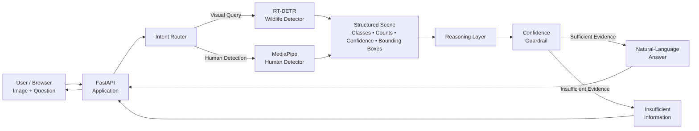


## Detection Pipeline

The detection pipeline accepts an image and processes it through the fine-tuned RT-DETR model to identify wildlife objects. For every detected object, the system extracts the predicted class, confidence score, and bounding-box coordinates.

Human detection is performed independently using the auxiliary MediaPipe EfficientDet-Lite0 detector. The resulting human detections are combined with the RT-DETR predictions to form a structured representation of the complete scene. This structured output is then used by the visual reasoning layer rather than relying on free-form visual interpretation.

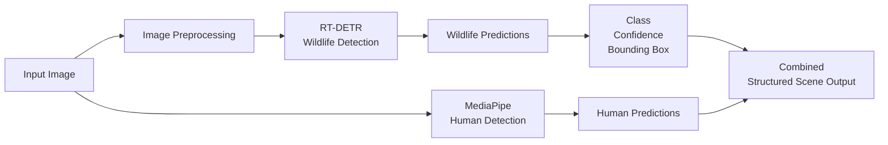

## Dataset & Data Preparation

WildGuard uses wildlife camera-trap imagery selected to represent challenging real-world monitoring conditions, including variations in illumination, background vegetation, viewpoints, occlusion, and environmental conditions.

The training data was converted into YOLO-compatible detection format and organized into separate training, validation, and test splits. Each annotation contains the object class and normalized bounding-box coordinates required for RT-DETR training.

The final detection taxonomy contains 12 classes, covering wildlife species together with a vehicle class for scene-context analysis.

| Class ID | Class |
|---:|---|
| 0 | elephant |
| 1 | jaguar |
| 2 | hyena |
| 3 | buffalo |
| 4 | baboon |
| 5 | leopard |
| 6 | tiger |
| 7 | lion |
| 8 | chimp |
| 9 | golden_cat |
| 10 | clouded_leopard |
| 11 | vehicle |

The dataset preparation process included class selection, image collection, annotation conversion, train/validation/test organization, and targeted dataset expansion after identifying class-specific errors during evaluation. In particular, additional lion samples were introduced after the initial evaluation revealed confusion involving the lion class.

### Dataset Pipeline

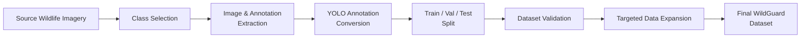


## Model & Training

WildGuard uses **RT-DETR** as its primary object detection model. The RT-DETR architecture was trained for the project-specific **12-class wildlife detection task**.

The dataset was divided into **70% training, 15% validation, and 15% test data**. The training split was used for model learning, the validation split was used to monitor performance during training, and the test split was kept separate for final evaluation.

Training was performed at **640 × 640** image resolution with a batch size of **8**. Automatic mixed precision (AMP) was enabled, with a fixed seed and deterministic training configuration for reproducibility.

| Configuration | Value |
|---|---|
| Architecture | RT-DETR |
| Dataset Split | 70% Train / 15% Validation / 15% Test |
| Image Size | 640 × 640 |
| Batch Size | 8 |
| Configured Maximum Epochs | 50 |
| Epochs Executed | 39 |
| Optimizer | Auto |
| Initial Learning Rate | 0.01 |
| Final Learning Rate Factor | 0.01 |
| Weight Decay | 0.0005 |
| Warmup Epochs | 3 |
| AMP | Enabled |
| Seed | 0 |
| Deterministic Training | Enabled |
| Dataset Classes | 12 |

### Targeted Class-Specific Fine-Tuning

During the initial evaluation, the model showed noticeable confusion involving a particular class (**lion**). To investigate whether targeted data expansion could address this issue, additional samples for the affected class were introduced and the model was further fine-tuned.

The initial training phase ran for **29 epochs**. Following the evaluation, the additional samples were incorporated and training was continued for another **10 epochs**, resulting in **39 executed epochs** in total.

The additional fine-tuning did not produce the expected improvement in overall detection performance. This highlighted that increasing the number of samples alone does not necessarily resolve class confusion and that **sample diversity, visual representation, and class separability** are important factors in object detection.

The trained `best.pt` checkpoint is retained as the deployable model weight and is distributed using Git LFS.

## Evaluation

WildGuard was evaluated on the held-out validation/test data using standard object-detection metrics. The final model achieved strong detection performance across the 12-class wildlife taxonomy.

| Metric | Result |
|---|---:|
| Precision | 89.29% |
| Recall | 88.48% |
| mAP@50 | 91.37% |
| mAP@50–95 | 77.40% |

The evaluation results indicate that the model provides a good balance between detection precision and recall while maintaining strong localization performance across the wildlife classes.

### Evaluation Results

The training and validation curves, along with the final evaluation outputs, are included below.

<!-- Add your training/evaluation plot screenshot here -->
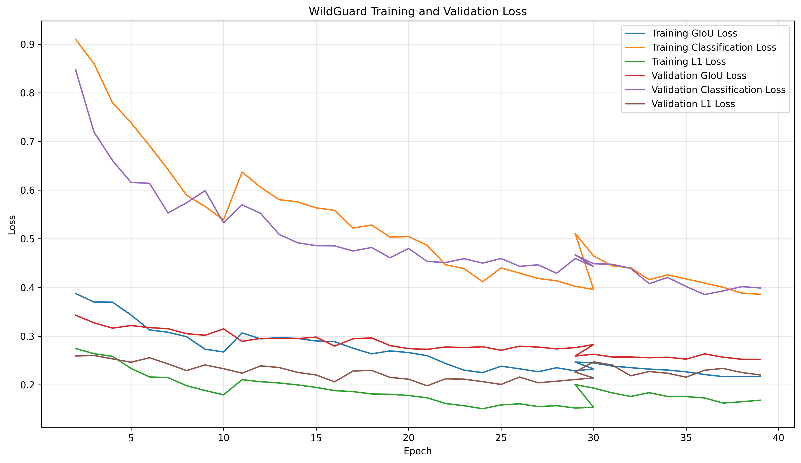

## Failure Analysis

WildGuard was evaluated on challenging visual conditions to identify cases where detection performance can degrade. The observed failure patterns were analyzed to understand their likely causes and guide future improvements.

| Failure Case | Observed Issue | Root Cause |
|---|---|---|
| Heavy Occlusion | Partial or missed detections | Vegetation or scene elements obscure important parts of the animal |
| Low-Light / Night Scenes | Lower confidence or missed detections | Reduced visual information and changes in animal appearance under infrared illumination |
| Similar Species | Incorrect class prediction | Visually similar species can produce overlapping feature representations |
| Small / Distant Animals | Weak localization or missed detections | Very small objects provide limited spatial and visual features |
| Complex Backgrounds | Unstable or incorrect predictions | Animal appearance can blend with vegetation and environmental textures |

These failure modes highlight the limitations of a detector operating on unconstrained wildlife imagery. The additional lion samples used during fine-tuning demonstrate an iterative approach to improving class-specific weaknesses identified during evaluation.

## Part B — Visual Reasoning

WildGuard extends object detection with a lightweight visual reasoning layer that accepts natural-language questions about an uploaded image. Instead of using an external LLM or agent framework, the system uses a hand-written intent router and deterministic reasoning logic over the structured detector output.

The router identifies the type of question and determines whether image evidence is required. When visual evidence is needed, the detection pipeline is invoked and the resulting classes, counts, confidence scores, and bounding boxes are passed to the reasoning layer.

The reasoning engine supports queries related to animal identification, presence, counting, human presence, vehicles, positions, groups, and basic human–wildlife threat conditions. A confidence guardrail prevents the system from making unsupported conclusions when the required evidence is unavailable or falls below the configured detection threshold.

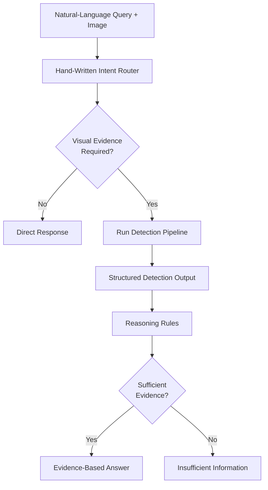

## Human Detection & Interaction Analysis

WildGuard includes an auxiliary human-detection component alongside the primary wildlife detector. Human presence is detected using a pretrained MediaPipe EfficientDet-Lite0 object-detection model with a person-only allowlist.

The resulting human detections are incorporated into the same structured scene representation as the RT-DETR wildlife detections. This enables the reasoning layer to identify scenes where humans and potentially dangerous wildlife occur in the same image.

The current interaction logic is based on same-frame co-occurrence rather than precise physical-distance estimation. When a dangerous wildlife class and a human are both detected with sufficient confidence, the system can classify the scene as requiring elevated attention.

| Scene Condition | WildGuard Interpretation |
|---|---|
| Dangerous animal + human detected | Rescue-level attention |
| Dangerous animal detected without human | Boundary-level attention |
| Human detected without dangerous animal | Human presence |
| No relevant threat condition | Clear |
| Required evidence unavailable | Insufficient information |

The auxiliary human detector is used specifically for human-presence detection and is separate from the fine-tuned WildGuard RT-DETR model.


## API

WildGuard exposes its detection and visual reasoning capabilities through a FastAPI service. The API supports direct object detection, annotated visual output, and natural-language reasoning over an uploaded image.

| Method | Endpoint | Purpose |
|---|---|---|
| GET | `/` | Serves the WildGuard web interface |
| POST | `/detect/json` | Returns structured wildlife and human detections |
| POST | `/detect/visual` | Returns an annotated image with detected objects |
| POST | `/analyze/` | Answers a natural-language question using image evidence |

The API returns structured detection information including detected classes, confidence scores, and bounding-box coordinates. The reasoning endpoint uses the same structured detection output to generate evidence-based responses.

Interactive API documentation is automatically available through FastAPI:

```text
http://localhost:8000/docs
```

### API Flow

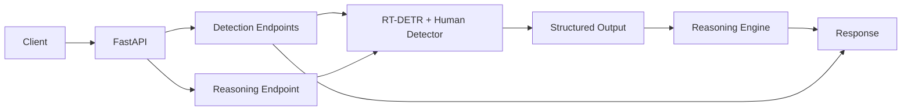

## Web Interface / Demo

WildGuard includes a browser-based web interface for interacting with the deployed detection and visual reasoning API. Users can upload an image, view the detected objects, and ask natural-language questions about the scene.

### Detection Interface

The interface provides image upload and displays the detection results generated by the WildGuard pipeline.

<!-- Add web interface screenshot here -->
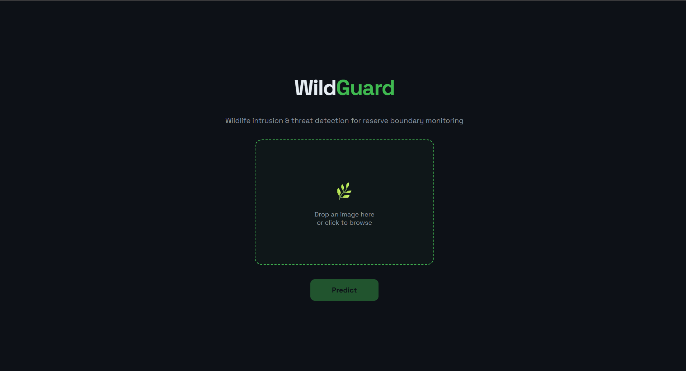

### Detection Results

Detected wildlife and human objects are displayed with their corresponding bounding boxes, class labels, and confidence information.

<!-- Add detection result screenshot here -->
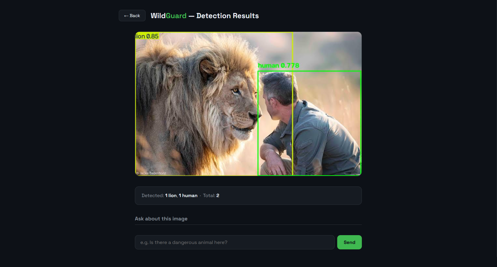

### Visual Reasoning

Users can ask questions about the uploaded image, such as animal identification, object presence, counting, human presence, vehicle detection, and basic threat conditions.

The response is generated from the structured detection output and the hand-written reasoning layer.

<!-- Add visual reasoning screenshot here -->
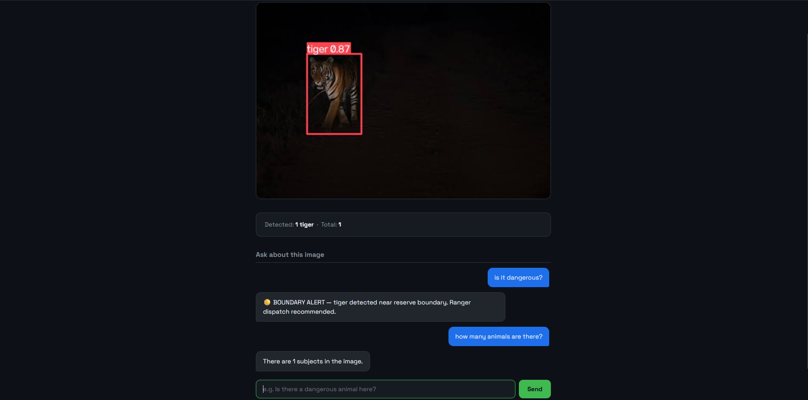

### Accessing the Interface

When the FastAPI server is running, the WildGuard interface is available at:

```text
http://localhost:8000/
```

## Docker Deployment

WildGuard is packaged as a GPU-enabled Docker container for reproducible deployment. The container includes the FastAPI application, trained RT-DETR weights, auxiliary human-detection model, configuration files, and required dependencies.

The Docker image uses an NVIDIA CUDA runtime environment and supports GPU inference through the NVIDIA Container Toolkit.

### Build the Docker Image

```bash
docker build -t wildguard .
```

### Run the Container

```bash
docker run --rm --gpus all -p 8000:8000 wildguard
```

Once the container is running, the application is available at:

```text
http://localhost:8000/
```

Interactive API documentation is available at:

```text
http://localhost:8000/docs
```

### Deployment Pipeline

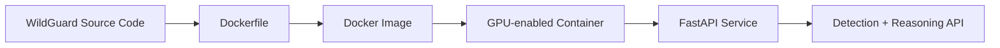

## Reproducibility

WildGuard is structured to make the training and deployment process reproducible. The project maintains the dataset configuration, training configuration, dependency versions, model weights, and Docker environment required to recreate the inference setup.

| Component | Configuration |
|---|---|
| Detection Model | RT-DETR |
| Dataset Configuration | `configs/wildguard.yaml` |
| Training Configuration | `models/wildguard/args.yaml` |
| Model Weights | `models/wildguard/weights/best.pt` |
| Image Size | 640 × 640 |
| Batch Size | 8 |
| Seed | 0 |
| Deterministic Training | Enabled |
| AMP | Enabled |
| Python | 3.10 |
| PyTorch | 2.5.1 |
| Ultralytics | 8.4.146 |

The final model was trained for **39 executed epochs**. Additional lion samples were incorporated after evaluation identified class-specific confusion, followed by further fine-tuning.

The project provides a pinned `requirements.txt` and Docker configuration to maintain a consistent inference environment across systems.

### Reproducibility Pipeline

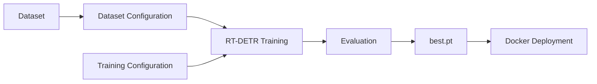

---

## Model Provenance

WildGuard's primary detector is based on an RT-DETR checkpoint pretrained on the COCO dataset and subsequently fine-tuned for the WildGuard wildlife detection taxonomy.

The training process began with the COCO-pretrained RT-DETR model and adapted it to the project-specific wildlife classes. During evaluation, class-specific confusion involving the lion class was identified. Additional lion samples were then incorporated into the training data and the model was further fine-tuned.

The final `best.pt` checkpoint represents the resulting WildGuard model after this targeted fine-tuning process.

### Primary Model

| Component | Details |
|---|---|
| Architecture | RT-DETR |
| Initial Weights | COCO-pretrained RT-DETR checkpoint |
| Fine-Tuning | WildGuard wildlife dataset |
| Final Classes | 12 |
| Final Checkpoint | `models/wildguard/weights/best.pt` |

### Auxiliary Human Detector

Human presence is detected separately using a pretrained **MediaPipe EfficientDet-Lite0** object-detection model with a person-only detection allowlist.

This auxiliary model is not part of the fine-tuned WildGuard RT-DETR checkpoint. It is used specifically to identify human presence and provide additional scene context for the reasoning layer.

The combination of the fine-tuned RT-DETR detector and the auxiliary human detector provides the structured evidence used by WildGuard's visual reasoning system.

## RAP Constraint Compliance

WildGuard was developed to satisfy the technical and implementation constraints specified for the RAP screening assignment.

| Requirement | WildGuard Implementation | Status |
|---|---|---|
| RT-DETR Object Detection | Fine-tuned RT-DETR detector for wildlife detection | ✅ |
| Custom Domain | Wildlife monitoring and camera-trap imagery | ✅ |
| Non-COCO Classes | Wildlife-specific taxonomy with 12 classes | ✅ |
| Custom Dataset | Prepared wildlife detection dataset with train/validation/test splits | ✅ |
| Evaluation | Precision, Recall, mAP@50 and mAP@50–95 reported | ✅ |
| FastAPI Endpoint | Detection and reasoning endpoints implemented with FastAPI | ✅ |
| Structured Detection Output | Classes, confidence scores and bounding boxes | ✅ |
| Natural-Language Reasoning | Hand-written intent routing and deterministic reasoning logic | ✅ |
| Confidence Guardrail | Insufficient-information responses for unsupported evidence | ✅ |
| Prohibited Agent Frameworks | No LangChain, LangGraph, CrewAI, AutoGen or similar frameworks used | ✅ |
| AutoML / No-Code | Training and inference implemented through code | ✅ |
| Reproducibility | Fixed seed, deterministic training, configuration files and pinned dependencies | ✅ |
| Containerized Deployment | GPU-enabled Docker deployment provided | ✅ |

The Part B reasoning system operates directly on structured detector outputs and does not depend on an external LLM or agent framework. This keeps the reasoning process deterministic and makes the decision logic inspectable.

---

## Project Structure

The repository is organized into separate modules for the API, model configuration, dataset configuration, trained weights, and supporting resources.

```text
WildGuard/
│
├── api/
│   ├── static/
│   │   └── index.html
│   ├── detection.py
│   ├── human_detector.py
│   ├── main.py
│   └── reasoning.py
│
├── configs/
│   └── wildguard.yaml
│
├── dataset/
│   └── classes.txt
│
├── models/
│   └── wildguard/
│       ├── weights/
│       │   ├── best.pt
│       │   ├── best_backup.pt
│       │   └── last.pt
│       └── args.yaml
│
├── src/
│
├── weights/
│   └── counter.py
│
├── configs/
│   └── wildguard.yaml
│
├── datasetRetrieval.py
├── human_detector_model.tflite
├── requirements.txt
├── Dockerfile
├── .dockerignore
├── .gitignore
└── README.md
```

### Core Components

| Component | Purpose |
|---|---|
| `api/main.py` | FastAPI application and route registration |
| `api/detection.py` | RT-DETR inference and detection processing |
| `api/human_detector.py` | Auxiliary human detection |
| `api/reasoning.py` | Intent routing, scene reasoning and guardrails |
| `api/static/index.html` | Browser-based WildGuard interface |
| `configs/wildguard.yaml` | Dataset and class configuration |
| `models/wildguard/args.yaml` | Training configuration |
| `models/wildguard/weights/best.pt` | Final trained RT-DETR checkpoint |
| `human_detector_model.tflite` | Auxiliary human-detection model |
| `requirements.txt` | Python dependency versions |
| `Dockerfile` | Container build configuration |

## Limitations

WildGuard provides an evidence-based detection and reasoning pipeline, but several limitations remain due to the complexity of unconstrained wildlife imagery.

- Detection performance can decrease under heavy occlusion, extreme low-light conditions, and complex vegetation.
- Visually similar wildlife species may still produce classification confusion.
- Small or distant animals can be difficult to localize reliably.
- Human–wildlife interaction analysis currently uses same-frame co-occurrence rather than precise physical-distance estimation.
- The reasoning layer is limited to the supported wildlife classes and predefined question categories.
- The system does not infer information that is not supported by the detector output and may return an insufficient-information response when evidence is unavailable.
- The auxiliary human detector is a separate pretrained model and may introduce additional detection errors.

These limitations are important when considering WildGuard for real-world wildlife monitoring, where environmental conditions and animal appearance can vary significantly from the training data.

---

## Future Improvements

Future development can improve WildGuard's robustness, reasoning capability, and suitability for large-scale wildlife monitoring.

- Expand the dataset with more geographic regions, species, camera viewpoints, and environmental conditions.
- Increase representation of night, infrared, rain, fog, and heavily occluded scenes.
- Add more challenging examples for visually similar wildlife species.
- Improve small-object detection for distant animals.
- Introduce temporal analysis across consecutive camera-trap frames rather than reasoning from a single image.
- Develop spatial-distance estimation for more accurate human–wildlife interaction analysis.
- Expand the reasoning engine with additional evidence-based question types.
- Add automated monitoring and alerting for repeated dangerous wildlife–human co-occurrence events.
- Evaluate the final model on larger and independently collected wildlife datasets.
- Optimize inference performance for edge devices and resource-constrained deployment environments.

## Tech Stack

WildGuard combines computer vision, deep learning, backend API development, and containerized deployment into a single end-to-end system.

| Category | Technologies |
|---|---|
| Programming | Python |
| Object Detection | RT-DETR |
| Deep Learning | PyTorch |
| Model Framework | Ultralytics |
| Human Detection | MediaPipe EfficientDet-Lite0 |
| Computer Vision | OpenCV, Pillow |
| API | FastAPI, Uvicorn |
| Data Processing | NumPy, Pandas, SciPy |
| Configuration | YAML |
| Deployment | Docker, NVIDIA CUDA |
| Version Control | Git, GitHub |
| Large Model Files | Git LFS |
| Web Interface | HTML, CSS, JavaScript |

---

## License / Acknowledgements

This project was developed as part of the **Rapid Acceleration Patterns (RAP) Pre-Hackathon Screening** and is intended to demonstrate an end-to-end constrained object detection and visual reasoning system.

### Acknowledgements

- **RT-DETR** — used as the primary object detection architecture.
- **Ultralytics** — used for model training and inference.
- **MediaPipe EfficientDet-Lite0** — used as the auxiliary pretrained human detector.
- **WCS Camera Traps / LILA** — used as a source of wildlife camera-trap imagery and annotations during dataset preparation.

The dataset, pretrained models, and third-party components remain subject to their respective licenses and terms of use.

### Project License

This repository contains project-specific source code and configuration developed for WildGuard. Third-party models, datasets, and libraries are not relicensed by this repository and remain subject to their original licenses.

